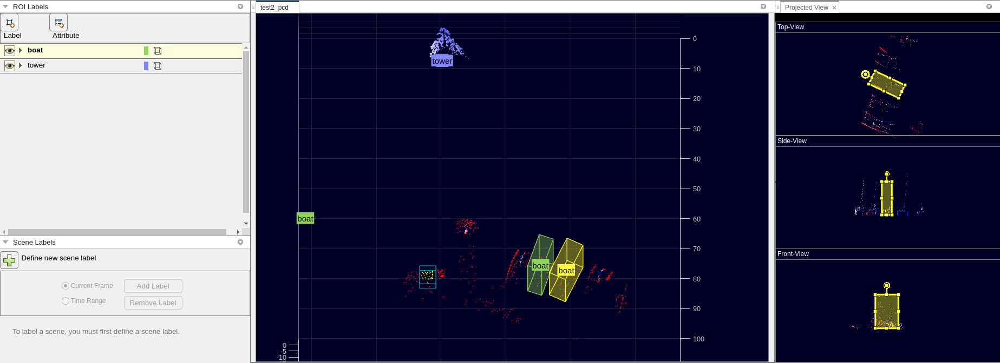

# Getting Started LIVOX-AVIA
This repository serves as a comprehensive guide on utilizing the LIVOX-AVIA LiDAR system, covering detailed instructions on its usage, accessing recorded data, and subsequently employing the data for object detection purposes.

## LIVOX Viewer
Upon connecting the LiDAR to the power source and ethernet, the initial step involves modifying the computer's IP address. Access the network settings of the computer and configure the IPv4 address to

``` shell
IP : 192.168.1.5
Subnet Mask : 255.255.255.0
```
Subsequently, to visualize the point clouds, we can make use of the LIVOX-Viewer tool, which is provided by Livox Tech. This software allows us to view and analyze the captured point cloud data from the LIVOX-AVIA LiDAR system.
Download the Livox-Viewer version 0.10 or 0.11 from the following link.
```shell
https://www.livoxtech.com/downloads
```
Once you have downloaded the LIVOX-Viewer software, extract the files from the downloaded package. After extraction, navigate to the folder where the LIVOX-Viewer is located. In this folder, you will find the executable or application file that you can run to launch the LIVOX-Viewer interface. This interface will enable you to interact with and visualize the point cloud data recorded by the LIVOX-AVIA LiDAR.

Run the livox viewer by running :
```shell
./livox_viewer.sh
```
Upon opening the LIVOX-Viewer, you will be able to see the list of available LIVOX LiDAR devices. Once your LIVOX-AVIA LiDAR is connected and recognized by the viewer, it will appear in the list. To observe the point clouds in real-time, simply click on the "play" button provided within the LIVOX-Viewer interface. This action will initiate the visualization of live point cloud data captured by the LIVOX-AVIA LiDAR in real-time.

## LIVOX-SDK 

Livox Tech offers a Software Development Kit (SDK) for their LiDAR devices, which enables developers to perform various operations and utilize the LiDAR's functionalities in their applications. For comprehensive details and information about the SDK, you can access the following link (provide the specific link to the Livox Tech website or SDK documentation page). There, you will find documentation, code samples, and resources to help you integrate and use the Livox LiDAR SDK effectively in your projects. Make sure to follow each step carefully. 
```shell
https://github.com/Livox-SDK/Livox-SDK
```
## Livox Detection-simu V1.0
In this repository, you will find the Livox Object Detection Version 1, which includes the necessary code to perform object detection using Livox LiDAR data. To enable distance measurement with object detection, you can replace the existing `livox_detection_simu.py` file in the repository with the provided file in `detection-v-1` folder. Once you replace the file, run the updated code, and it will integrate distance measurement with the object detection functionality, utilizing Livox LiDAR data for accurate results.
```shell
https://github.com/Livox-SDK/livox_detection_simu
```
Please ensure that you have the required dependencies and hardware set up correctly before running the modified code for proper functionality.
```shell
Please make sure that the fixed_frame in RVIZ is changed to livox_frame
```
## Livox Detection V2
In this repository, you will find the Livox Object Detection Version 2, which includes the necessary code to perform object detection using Livox LiDAR data. To enable distance measurement with object detection, you can replace the existing `test_ros.py` and `vis_ros.py` files from `tools` folder in the repository with the provided files in `detection-v-2` folder. Once you replace the file, run the updated code, and it will integrate distance measurement with the object detection functionality, utilizing Livox LiDAR data for accurate results.
```shell
https://github.com/Livox-SDK/livox_detection
```
For seamless operation, it is essential to have both the CUDA version and the PyTorch Cuda version identical. This ensures compatibility and enables efficient utilization of GPU resources for accelerated processing.
```shell
Please make sure that the fixed_frame in RVIZ is changed to livox_frame
```

## Data Collection with LIVOX
There are two methods to obtain data from the LiDAR: using the `Livox Viewer` or the `Livox SDK`. In both approaches, the data is saved in the `.lvx` file format. To further process and utilize the data for training with deep learning models, you can convert the `.lvx` files to `.bag` files. For comprehensive information and guidelines, please refer to the Livox SDK repository, where you can find detailed instructions and resources to aid you in this process.

## Conversion of Data from .bag to .pcd
Please run the following command to convert rosbag to pointcloud. 

```shell
rosrun pcl_ros bag_to_pcd <input_file.bag> <topic> <output_directory>
```
## Labeling data in MATLAB

To utilize MATLAB Lidar Labeler for data labeling, execute the following command to run the application.

```shell
lidarLabeler
```
Once you have launched MATLAB Lidar Labeler, start a new session by selecting the "New Session" option. In the new session, you can proceed to upload the point cloud files that you want to label. This will allow you to begin the labeling process and annotate objects of interest within the point cloud data.
Select the label as Cuboid and label the objects from the point cloud. 
### Automatic Labeling Using MATLAB
To automate the labeling process in MATLAB Lidar Labeler, follow these steps:

- Open MATLAB Lidar Labeler and load the point cloud data for labeling.

- Manually label one object of interest in each frame for around 10-20 frames. Ensure that you label the same object consistently in each frame.

- After manual labeling, use one of the provided automation algorithms in MATLAB Lidar Labeler. This algorithm will attempt to label the selected object automatically in the subsequent frames.

- Review the automated labels and correct any inaccuracies or mistakes. This step is crucial to ensure the accuracy of the automated labeling.

- Repeat the process for each object you want to label automatically. For each object, select one instance of it in each frame and apply the automation algorithm followed by manual corrections.

By following this approach, you can accelerate the labeling process while still maintaining the accuracy of the annotations by using the provided automation algorithms and making manual corrections as needed.